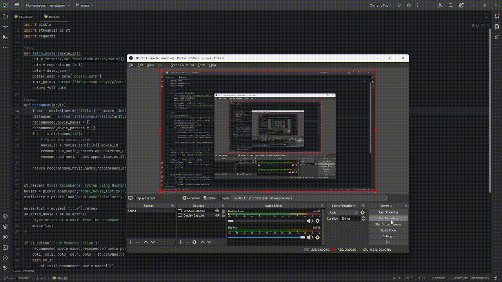
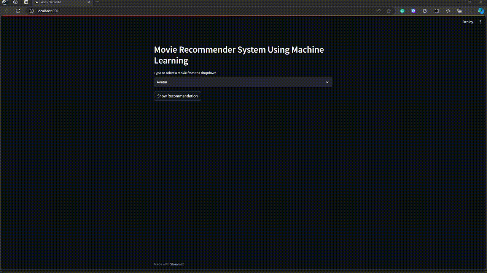

<h1>Movie Recommendation System</h1>
<h2>How to start the Streamlit App</h2>
##Steps to run the project
1. Clone the repository to your local machine

2. Extract the `model.zip` folder.

3. Open the, `app.py` file and install all the requirements.

4. Run the command, `pip install -r requirements.txt`

    
    

